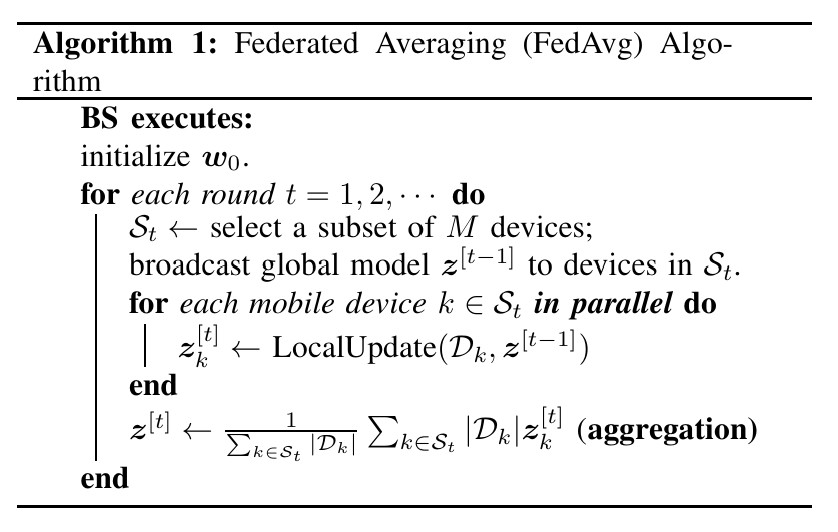

# Federated Averaging (FedAvg) Implementation with MNIST

+Minimal PyTorch implementation of Federated Averaging (FedAvg) based on the original federated learning framework.  
+The code is designed as a baseline for research, and can be easily extended to Over-the-Air Federated Learning (OTA-FL) by modifying only the aggregation module.
+This implementation is based on the paper [Communication-Efficient Learning of Deep Networks from Decentralized Data](https://arxiv.org/abs/1602.05629).

## Algorithm

## Training
python train.py 

## Evaluation
python eval.py --ckpt checkpoints/fedavg_mnist.pt
